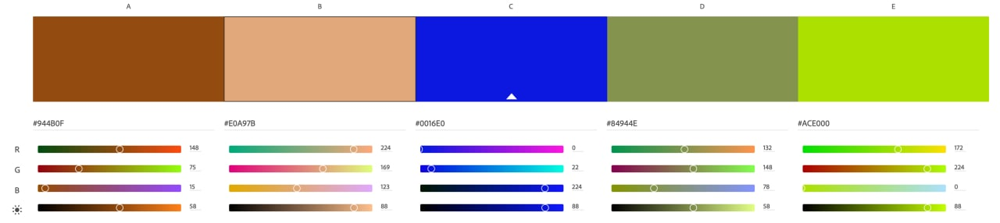

# Contribution Guide

In the following document, you'll learn about the procedure of contributing to Jabir Technologies artwork. This document contains our policies and guidelines as well as a guide of registering your candidate artwork.

## Artwork policies

1. Since all products of _Jabir Technologies_ are being used by people of all ages, all artworks should NOT contain any form of _Not Suitable For Work_ content, which contains everything regarding nudity, alcohol or drug usage, graphic and gore imagery, etc.
2. Artworks should NOT infringe any copyrights or violate IP's (as in intellectual property) in any form, otherwise they won't be accepted by us.
3. We do not force you to use specific tools to create artwork, but FLOSS tools (such as InkScape or GIMP) are always appreciated and encouraged. 
4. A color palette will be provided further in this document for designer concerns.

### AI generated material

Since _Jabir Technologies_ is always open to innovating and pioneering technologies, there is no restrictions against AI generated material as long as they are not in violation of our policies. 

## How to contirbute

### Color Palette

### How to register an artwork
